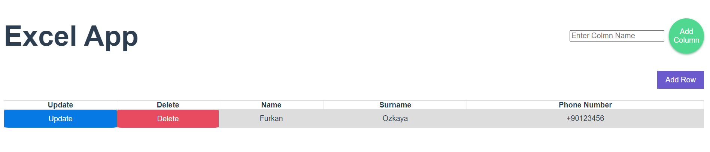

# excel_vue



Check backend => [postgresql_json_excel](https://github.com/FurkanOzkaya/postgresql_json_excel)

## Note:

Default backend link => http://127.0.0.1:9000/api/

Run backend in 9000 port or change these value in code.

These  values is seperate for all request. [Bad practice] :)

Feel free to improve.

## Project setup
```
npm install
```

### Compiles and hot-reloads for development
```
npm run serve
```

### Compiles and minifies for production
```
npm run build
```

### Lints and fixes files
```
npm run lint
```
